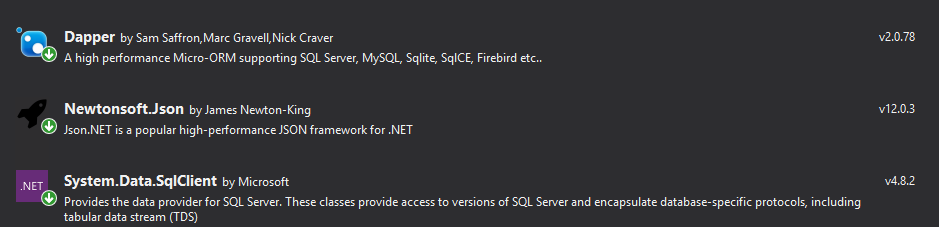

# DapperExample

Ejemplo de uso del ORM Dapper

# ¿Qué es Dapper?
Dapper es un mapeador de objetos simple para .NET y posee el título de King of Micro ORM en términos de velocidad y es virtualmente tan rápido como usar un lector de datos ADO.NET sin procesar. Un ORM es un mapeador relacional de objetos, que es responsable del mapeo entre la base de datos y el lenguaje de programación.

Dapper extiende IDbConnection al proporcionar métodos de extensión útiles para consultar su base de datos.

# ¿Cómo funciona Dapper?
Es un proceso de tres pasos.

- Cree un objeto IDbConnection.
- Escribe una consulta para realizar operaciones CRUD.
- Pase la consulta como parámetro en el método Execute.

# Instalación
Dapper se instala a través de NuGet: https://www.nuget.org/packages/Dapper

PM> Instalar paquete Dapper

# Requisito
Dapper trabaja con cualquier proveedor de base de datos ya que no existe una implementación específica de la base de datos.

# Package usados en el ejemplo

- Dapper
- Newtonsoft.Json
- System.Data.SqlClient

Mas informacion sobre Dapper
https://dapper-tutorial.net/dapper

